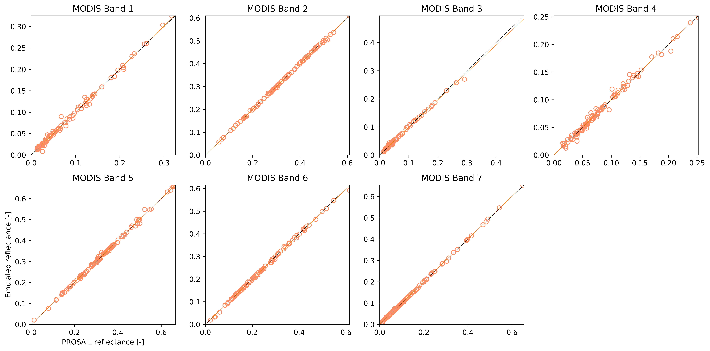
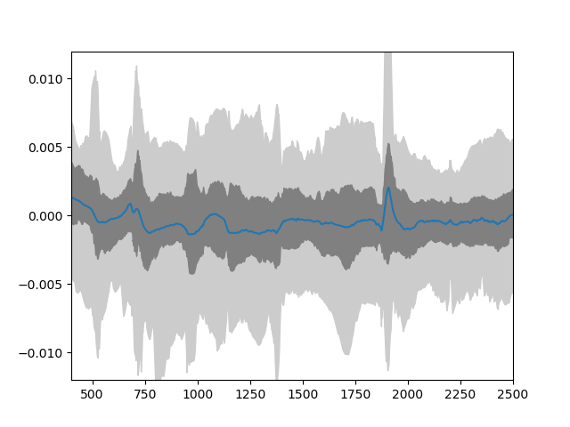

Emulating a typical radiative transfer model
===============================================

This package was designed to emulate radiatie transfer models. The process entails the following steps:

1. Decide on what input parameters are required
2. Decide their ranges
3. Generate a training input parameter set
4. Run the model for each element of the input training set and store the outputs
5. Pass  the input and output training pairs to the library, and let it fit the hyperparameters

We can show how this works with an example of the PROSPECT+SAIL model. 

Setting the input parameter ranges
-----------------------------------

We can set the parameter names and their ranges simply by having lists with minimum and maximum values. This assumes a uniformly-distributed parameter distribution between those two boundaries, but other distributions are possible (we never had any reason to try them though!). We additionally set up the SRFs and other variables that need to be defined here... We train the model on 250 samples and test on (say) 100. 100 validation samples is probably too few, but for the sake of not waiting too much... ;-)

.. code-block:: python

    from functools import partial

    import numpy as np

    import gp_emulator

    import prosail

    # Spectral band definition. Just a top hat, with start and 
    # end wavlengths as an example
    b_min = np.array( [ 620., 841, 459, 545, 1230, 1628, 2105] )
    b_max = np.array( [ 670., 876, 479, 565, 1250, 1652, 2155] )
    wv = np.arange ( 400, 2501 )
    passband = []

    # Number of training and validation samples
    n_train = 250
    n_validate = 100
    # Validation number is small, increase to a more realistic value
    # if you want

    # Define the parameter names and their ranges
    # Note that we are working here in transformed coordinates...

    # Define geometry. Each emulator is for one geometry
    sza = 30.
    vza = 0.
    raa = 0. # in degrees

    parameters = [ 'n', 'cab', 'car', 'cbrown', 'cw', 'cm', 'lai', 'ala', 'bsoil', 'psoil']
    min_vals = [ 0.8       ,  0.46301307,  0.95122942,  0.        ,  0.02829699,
            0.03651617,  0.04978707,  0.44444444,  0.        ,  0.]
    max_vals = [ 2.5       ,  0.998002  ,  1.        ,  1.        ,  0.80654144,
            0.84366482,  0.99501248,  0.55555556,  2.   , 1     ]

We then require a function for calling the RT model. In the case of PROSAIL, we can do that easily from Python, in other models available in e.g. Fortran, you could have a function that calls the external model

.. code-block:: python

    def inverse_transform ( x ):
        """Inverse transform the PROSAIL parameters"""
        x_out = x*1.
        # Cab, posn 1
        x_out[1] = -100.*np.log ( x[1] )
        # Cab, posn 2
        x_out[2] = -100.*np.log ( x[2] )
        # Cw, posn 4
        x_out[4] = (-1./50.)*np.log ( x[4] )
        #Cm, posn 5
        x_out[5] = (-1./100.)*np.log ( x[5] )
        # LAI, posn 6
        x_out[6] = -2.*np.log ( x[6] )
        # ALA, posn 7
        x_out[7] = 90.*x[7]
        return x_out

    def rt_model ( x, passband=None, do_trans=True ):
        """A coupled land surface/atmospheric model, predicting refl from
        land surface parameters. Thisfunction provides estimates of refl for 
        a particular illumination geometry.
        
        The underlying land surface reflectance spectra is simulated using
        PROSAIL. The input parameter ``x`` is a vector with the following components:
            
            * ``n``
            * ``cab``
            * ``car``
            * ``cbrown``
            * ``cw``
            * ``cm``
            * ``lai``
            * ``ala``
            * ``bsoil``
            * ``psoil``

        """
        x, sza, vza, raa = x

        # Invert parameter LAI
        if do_trans:
            x = inverse_transform ( x )
        ################# surface refl with prosail #####################
    
        surf_refl = prosail.run_prosail(x[0], x[1], x[2], x[3], x[4], x[5], x[6], x[7], 0.01, sza, vza, raa,
                        rsoil=x[8], psoil=x[9])
        if passband is None:
            return surf_refl
        else:
            return surf_refl[passband].mean()

Now we loop over all the bands, and prepare the emulators. we do this by using the `create_emulator_validation` function, that does everything you'd want to do... We just stuff the emulator, training and validation sets in one list for convenience. 

.. code-block:: python

    retval = []
    for iband,bmin in enumerate ( b_min ):
        # Looping over the bands....
        print("Doing band %d" % (iband+1))
        passband = np.nonzero( np.logical_and ( wv >= bmin, wv <= b_max[iband] ) )
        # Define the SRF for the current band
        # Define the simulator for convenience
        simulator = partial (rt_model, passband=passband)
        # Actually create the training and validation parameter sets, train the emulators
        # and return all that 
        x = gp_emulator.create_emulator_validation (simulator, parameters, min_vals, max_vals, 
                                    n_train, n_validate, do_gradient=True, 
                                    n_tries=15, args=(30, 0, 0) )
        retval.append (x)

        
A simple validation visualisation looks like this

   
   Comparison between the simulated output and the corresponding emulator output for the validation dataset. Correlations (R2) are in all cases better than 0.99. Slope was between 0.97 and 1., whereas the bias term was smaller than 0.002.
   
   
An spectral emulator of PROSAIL
---------------------------------

For the case of a spectral emulator, the approach is the same, only that we just use the spectral emulator, which is a bit simpler.

code-block:: python

    n_train = 350
    n_validate = 100
    x = gp_emulator.create_emulator_validation ( rt_model, parameters, min_vals, max_vals, 
                                    n_train, n_validate, do_gradient=True, 
                                    n_tries=10, args=(30, 0, 0) )
                                    
                                    

   
   Distribution of residuals derived from the difference of the emulator and simulator for PROSAIL.
                                    
